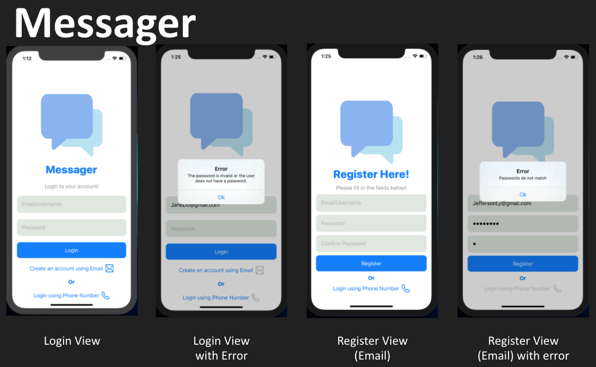
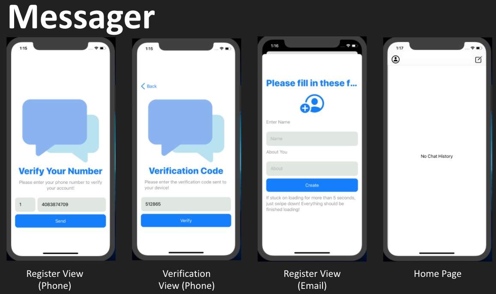
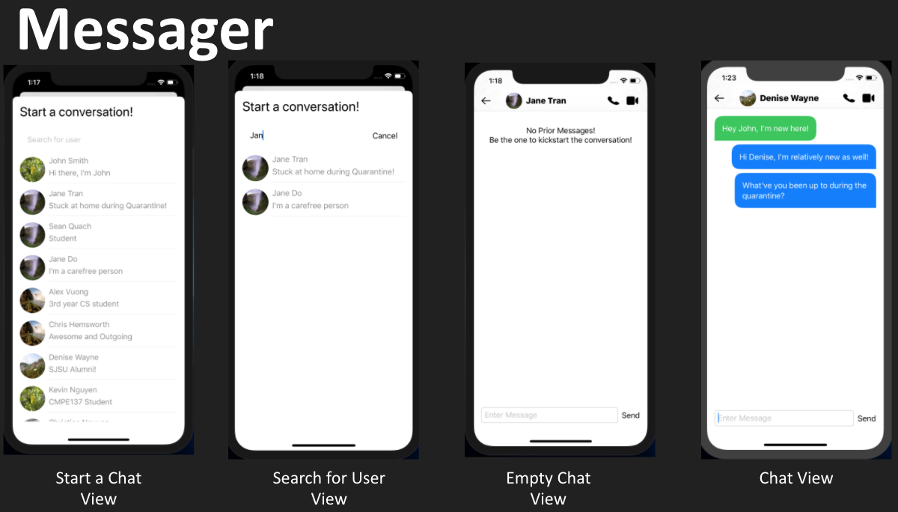
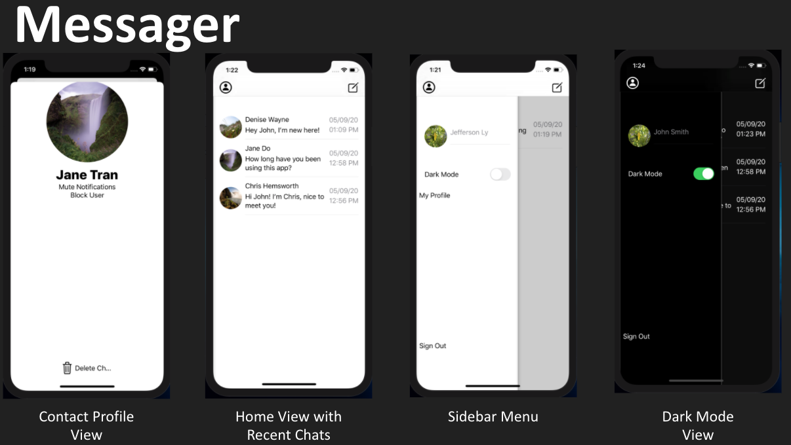

# Swift-RealTime-Chat-App
Swift Chatting application 

## Table of Contents
1. [Project Introduction](#project-introduction)
2. [Pictures of Views](#pictures-of-views)
3. [Tools/Technologies Used](#tools/technologies-used)
4. [How to Run the Project Locally](#how-to-run-the-project-locally)

## Project Introduction

For the project, the team decided to create a real time chat application. This real time chat application would allow users to message each other, as well as provide additional features. Communication is an essential part of everyday life, so the team wanted to create an alternative solution to this. Many messaging apps already exist; however, the team wanted to get experience with developing an application with these functionalities.

## Pictures of Views

## Tools/Technologies Used

- XCode
- Swift
- Github
- Firebase
- CocoaPods
- UIKit

## How To Run the Project Locally

To set up the project locally, clone the project to your computer. Then navigate to the folder using terminal and type the command 'pod install'. Afterwards, load the file named "Chat App.xcworkspace" and build/run the application.
